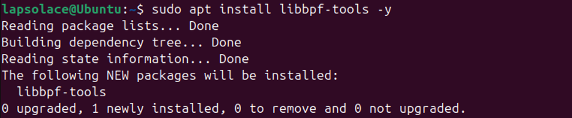
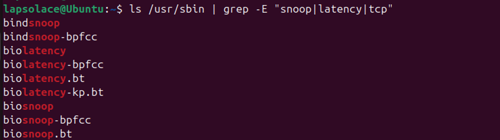

## CYBR 599: Directed Study
## Name: Temitope James DADA
## Week 3: Understanding and evaluation of existing eBPF tools, including a summary of how they attach to kernel events, collect telemetry, and integrate with Kubernetes environments.
**1.	What is eBPF and its function**

eBPF  which is extended Berkeley Packet Filter is a Linux kernel technology that allows small, sandboxed programs to run safely inside the kernel without requiring kernel modules or patches. It extends the original BPF packet filtering system into a general purpose execution engine capable of observing, filtering, and reacting to kernel events.

The core function is runtime visibility and control. The programs attach to kernel hooks such as syscalls, tracepoints, kprobes, uprobes, and network events and collect telemetry or enforce policies with minimal CPU and memory usage, making them safe to run continuously in production systems. This enables powerful observability, security monitoring, and performance analysis directly from the kernel, without destabilizing the system.

**2.	Categories of eBPF tools and examples of them**

**Observability:** This helps in understanding what the system is doing, such as tracing, profiling, monitoring.
Examples:
- BCC tools (execsnoop, opensnoop, biolatency)
- Bpftrace
- Tetragon (partially)
- Cilium Hubble

**Security:** This is majorly for runtime detection and policy enforcement 
Examples:
- Falco
- Tetragon (security mode)
- Cilium Network Policies
- Katran (L4 load balancing with eBPF)
•	Tracee (Aqua Security)

**Networking:** High-performance packet processing
Examples:
- Cilium (full eBPF-based CNI)
- Katran (Facebook L4 load balancer)
- XDP-based firewalls

**System acceleration / kernel enhancement:** Using eBPF to replace kernel subsystems 
Examples:
- bpfilter (iptables replacement)
- IO_uring + eBPF integrations
- BPF LSM (security modules)
3.	Evaluation of Existing eBPF Observability Tools
eBPF observability tools fall into two groups: single purpose tools and multi purpose tools.
- Single purpose tools (e.g., execsnoop, opensnoop, tcpconnect, biolatency) each of them focuses on one specific kernel event. They are lightweight, easy to run, and ideal for quick diagnostics of what is happening.
- Multi purpose tools (e.g., trace, funccount, argdist) they provide flexible instrumentation or observability across many kernel functions or tracepoints. They allow deeper analysis and custom probes but require more knowledge of kernel internals.
4.	Comparing eBPF Security Platforms: Falco, Tetragon, Tracee
Modern eBPF security platform like Falco uses eBPF to detect runtime threats inside Linux and Kubernetes environments.
- Falco: It uses eBPF and optionally kernel modules to detect suspicious syscalls, container activity, and policy violations. It focuses on high level security rules and integrates well with Kubernetes.
- Tetragon: it uses eBPF for deep runtime visibility, process tracing, network enforcement, and capability monitoring. It provides richer context and supports advanced security policies. It provides both observability and security, depending on how it is configured.
- Tracee: Tracee is by Aqua Security, it is a lightweight eBPF based threat detection engine that focused on syscall tracing, behavioral detection, and malware analysis.
Falco is about simplicity and Kubernetes integration, Tetragon is about advanced runtime security, and Tracee emphasizes forensic style syscall analysis.
5.	How eBPF Tools Attach to Kernel Events and Collect Telemetry
eBPF tools attach to kernel events such as kprobes, tracepoints, uprobes, and socket filters. When the kernel triggers these events, the attached eBPF program executes safely inside the kernel, collecting telemetry such as process names, file paths, network addresses, or latency measurements. The data is then passed to user space through maps or ring buffers, where tools format and display the results. This model enables high performance, low overhead observability without modifying kernel code.
6.	eBPF tooling frameworks that I will be focusing on
- BCC (BPF Compiler Collection): it is a high level eBPF development framework that uses Clang/LLVM to compile eBPF programs at runtime and provides Python/C APIs for building custom tools. Also, BCC CLI tools often break on modern kernels because they rely on fragile kernel struct layouts, while BCC Python scripts can avoid these issues by using stable tracepoints.
- libbpf‑tools: are precompiled CO‑RE eBPF utilities built on the libbpf library; they do not compile anything at runtime and are stable across modern kernels.

7.	Installation process of eBPF BCC and libbpf-tools on Ubuntu
- I updated the system packages to ensure that the kernel, headers, and toolchain are aligned. It prevents version conflicts when compiling or loading eBPF programs.
`sudo apt update && sudo apt upgrade -y`
- The BCC Python needs kernel headers to compile eBPF programs at runtime. It is not required for libbpf-tools, but it’s required for BCC Python only. Since I will be working with python I need to install it also.
`sudo apt install linux-headers-$(uname -r) -y`
- I Installed libbpf-tools that is recommended for tracing. They are the modern, CO‑RE eBPF tools that work reliably on all new Ubuntu kernels.
`sudo apt install libbpf-tools -y`
 
	
- I Installed BCC Python bindings so that I can use `from bcc import BPF`while writing eBPF programs in python
`sudo apt install python3-bpfcc -y`
- To verify installed tools I used `ls /usr/sbin | grep -E "snoop|latency|tcp"` to list available libbpf-tools:
 

- To test the installation, I ran `sudo execsnoop`,  then used another terminal to run `ls` and `whoami`
 
