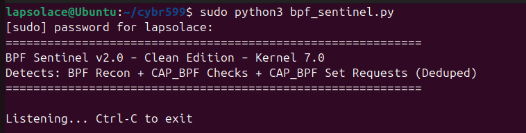
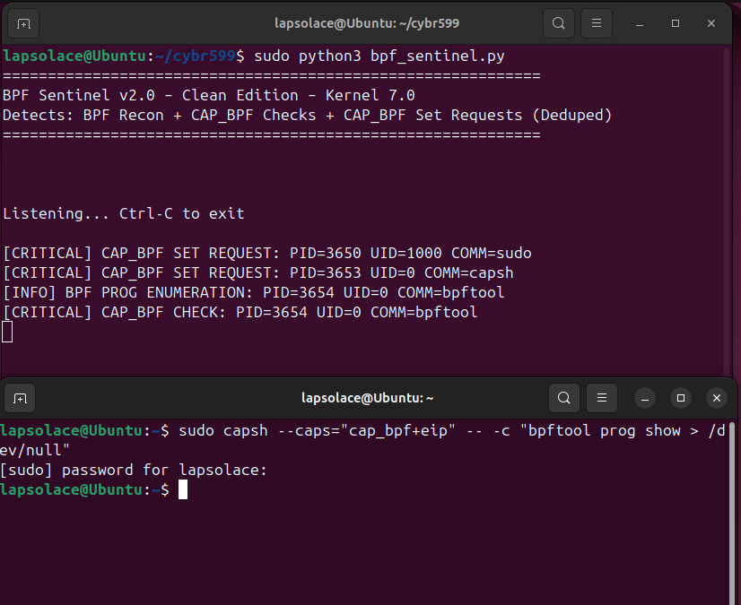

## BPF Sentinel v2.0
## Runtime Detection of BPF Tampering and CAP_BPF Capability Misuse

#### **1. Introduction & Problem Statement**
eBPF has become a core part of the Linux kernel for networking, security, and observability. However, with Linux 5.8+, the introduction of `CAP_BPF` created a new attack surface. An attacker with `CAP_BPF` can enumerate, inspect, and hijack existing BPF programs and maps without needing full `CAP_SYS_ADMIN`.

Traditional tools like `auditd` miss this because `bpf()` syscalls are not logged by default, and capability checks are high-volume and noisy.

**Research Gap Addressed**: There is no lightweight, in-kernel runtime detector that specifically correlates 3 things: 
1. BPF Reconnaissance 
2. `CAP_BPF` capability checks 
3. `CAP_BPF` privilege escalation via `capset`

#### **2. System Architecture & How It Works**
BPF Sentinel v2.0 is a userspace Python tool using BCC that attaches eBPF programs to stable kernel tracepoints. It operates entirely in kernel space and only sends 4 types of security events to userspace.

`Privilege Escalation -> Capability Use -> BPF Recon`

**Core Components:**

1. **Event Structure**
    All detections are sent via a single `perf_event` struct:

```
    struct event_t {
        u32 pid; // Process ID
        u32 uid; // User ID of the process
        u32 event_type; // 1=map_enum, 2=prog_enum, 3=cap_bpf_check, 4=cap_bpf_set
        char comm[16]; // Process name
    };

```
2. **BPF Program Logic in Kernel**
    The BPF code attaches to 4 tracepoints:

|   Tracepoint  |   Function    |   Purpose |
|   -----------  |   ---------   |   ------- |
|   `syscalls:sys_enter_bpf`    | Record BPF Command    | Saves the `cmd` argument to a `cmd_map` keyed by `pid_tgid`   |
|   `syscalls:sys_exit_bpf` | Detect BPF Recon   | On exit, checks if `cmd` was `BPF_MAP_GET_NEXT_ID=12` or `BPF_PROG_GET_NEXT_ID=11`. If yes, fires event_type 1 or 2. Uses `seen_enum` hash to ensure only 1 alert per process run.   |
|   `capability:cap_capable`    | Detect CAP_BPF Use    | Fires when any process checks for `CAP_BPF=39`. Deduped to 1 alert per PID every 2 seconds using `last_cap_check`.    |
|   `syscalls:sys_enter_capset` | Detect CAP_BPF Escalation  | Reads the `capset` arguments. Only fires event_type 4 if bit 39 `CAP_BPF` is being set in `effective`, `permitted`, or `inheritable`. Deduped to 1 alert per PID every 5 seconds.    |
|   `sched:sched_process_exit`  | Cleanup | Deletes PID from all dedup maps to prevent memory leaks on long running systems.    |

3. **Userspace Logic**
    The Python code loads the BPF program, opens the perf buffer, and prints clean, color-coded output. It also hides all BCC/clang compile warnings for clean screenshots.
    `INFO` = Recon. `CRITICAL` = Capability abuse/escalation.

#### **3. Key Features of v2.0**
1. **Deduplication**: The V1.0 has the multiline output spam which is a normal BPF monitoring problem. V2.0 Solves that problem spam. You get 1 line per `bpftool` run, not 200 lines.
2. **Attack Focused**: Only alerts on `CAP_BPF`, not all capabilities. Only alerts on enumeration commands, not all 50+ bpf commands.
3. **Kernel 7.0 Compatible**: Uses only stable `TRACEPOINT_PROBE`. No fragile `kprobes` with changing function signatures.
4. **Leak Proof**: Cleans up all BPF maps on process exit.
5. **Clean Output**: The output is simple enough to interpret and understand

#### **4. Deployment & Testing**
**Prerequisites:** `sudo apt install bpfcc-tools python3-bpfcc libcap2-bin bpftool`

**Step 1: Run the Sentinel**

`sudo python3 bpf_sentinel_v2_0.py`

Output:



**Step 2: Simulate an Attack**

Run this in a second terminal to simulate an attacker gaining `CAP_BPF` and enumerating programs:

`sudo capsh --caps="cap_bpf+eip" -- -c "bpftool prog show > /dev/null"`



**Step 3: Detection Result**
The sentinel immediately detects the full chain:
[CRITICAL] CAP_BPF SET REQUEST: PID=3650 UID=1000 COMM=sudo
[CRITICAL] CAP_BPF SET REQUEST: PID=3653 UID=0 COMM=capsh
[INFO] BPF PROG ENUMERATION: PID=3654 UID=0 COMM=bpftool
[CRITICAL] CAP_BPF CHECK: PID=3654 UID=0 COMM=bpftool

**Analysis of Output:**
1. `UID=1000 sudo`: User escalates to root.
2. `UID=0 capsh`: `capsh` sets `CAP_BPF` in the process capabilities.
3. `UID=0 bpftool`: With `CAP_BPF`, `bpftool` enumerates all BPF programs. This is step 1 of any BPF hijacking attack.


#### **5. Conclusion**
BPF Sentinel v2.0 demonstrates a practical approach to detecting modern eBPF-based attacks. By correlating `capset` + `cap_capable` + `bpf` syscalls, we can detect capability misuse in real time with minimal noise.

The use of perPID deduplication and process exit cleanup makes this suitable for production use on Kernel 5.8 to 7.0+.

This tool proves that monitoring capabilities is just as important as monitoring syscalls when dealing with BPF.


## Reference:
- https://dohost.us/index.php/2025/11/07/developing-your-first-ebpf-program-in-python-with-bcc/
- Google.com