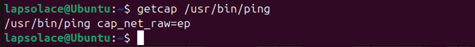
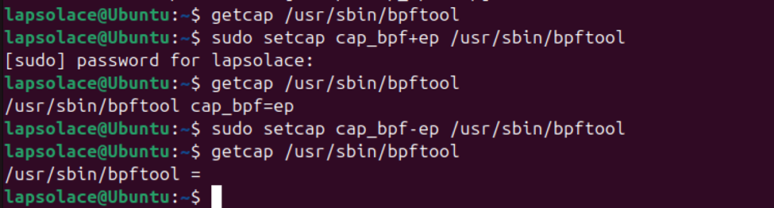

## Week 6
## Objective: Understanding Kernel Events and Linux Capabilities
### 1.	Common Kernel Events / Hook Points Used by eBPF

**Networking**

eBPF provides deep visibility and control over packet processing by attaching to networking hook points inside the kernel. These hooks allow programs to inspect, filter, redirect, or modify packets at a very high speed. Its common networking hooks include:

**•	XDP (Express Data Path):** Runs at the earliest point in the NIC driver, ideal for ultrafast packet filtering and DDoS mitigation.

**•	TC (Traffic Control):** Attaches to ingress/egress queues for shaping, filtering, and monitoring network flows.

**•	Socket Filters:** Attach to sockets to inspect or filter traffic per application.

**•	cgroup networking hooks:** Enforce per container network policies.

**•	LWT (Lightweight Tunnels):** Modify routing behavior for advanced networking setups.

These hooks makes eBPF a foundation importance for modern cloud networking tools like Cilium and Katran.

**Security**

eBPF integrates with kernel security subsystems to enforce policies, detect attacks, and monitor sensitive operations. Its common security hook points include:

**•	LSM (Linux Security Module) hooks:** eBPF can attach to file access, process execution, network operations, and permission checks.

**•	Capability checks:** Hooks like cap_capable detect when processes request privileged capabilities such as CAP_BPF or CAP_SYS_ADMIN.

**•	Syscall entry/exit:** Tracepoints like sys_enter_execve, sys_enter_openat, and sys_enter_bpf allow monitoring of process behavior and privilege escalation.

**•	Cgroup hooks:** Enforce container level security policies.

**•	Kprobes on sensitive kernel functions:** Monitor internal kernel behavior for anomalies.

**Tracing**

eBPF is widely used for observability and performance analysis by attaching to tracing hook points that expose kernel activity. These are the common tracing hooks:

**•	Kprobes / Kretprobes:** Dynamic instrumentation of kernel functions (entry and exit).

**•	Uprobes / Uretprobes:** Instrumentation of user space functions.

**•	Tracepoints:** Stable kernel instrumentation points for syscalls, scheduler events, block I/O, networking, and more.

**•	Perf events:** CPU performance counters, hardware events, and sampling.

**•	fentry/fexit:** Modern, fast function entry/exit hooks using BTF.

These hooks are used by tools like bpftrace, BCC, perf, and modern observability platforms. Tools like Falco, Tetragon, Tracee, and KubeArmor, uses hooks that are specific to security for their functionality. 

### 2.	Linux Capabilities
Linux capabilities break the sudo root privilege into smaller permissions that can be assigned to a process or program, it is a demonstration of Principle of Least Privilege(PoLP). Instead of giving a process full root access, the kernel allows assigning only the specific privileges it needs such as controlling networking, loading eBPF programs, changing file ownership, or performing system administration tasks.

It improves security by reducing the huge radius of compromised applications that can affect systems. Capabilities are enforced by the kernel and can be granted, removed, or inherited by processes, containers, and services. Modern container platforms (Docker, Kubernetes) uses capabilities to isolate workloads and prevent privilege escalation.

**Common examples include:**

- CAP_NET_ADMIN: modify network interfaces, firewall rules
- CAP_SYS_ADMIN: extremely powerful, it gives a root like permission.
- CAP_BPF: load, modify, or delete eBPF programs/maps
- CAP_SETUID / CAP_SETGID: change user/group IDs
- CAP_DAC_OVERRIDE: bypass file permission checks

Capabilities allow precise control over what a process can do inside the kernel, making them essential for container security, sandboxing, and modern privilege management.

**Linux Capabilities have three sets:**

- Permitted (P): what the process is allowed to use
- Effective (E): what the process is currently using
- Inheritable (I): what can be passed to child processes

**Checking for process’s capability**

`Getcap` is used to check for a process’s capabilities
- Ping
 
It shows that ping does not need full root permission, it only needs the ability to send raw network packets, so cap_net_raw=ep capability alone is enough to execute that.
- Bpftool

I used `getcap /usr/sbin/bpftool` to check for the capability that is attached to bpftool binary and it shows nothing, which means no capability is attached. Then I used `sudo setcap cap_bpf+ep /usr/sbin/bpftool`to set CAP_BPF to it. This makes it easy for any user to be able to run `bpftool prog show` without sudo, because the capability is attached to the binary itself. 
This is dangerous because it can be used wrongly to attack the system, so I remove the capability with `sudo setcap cap_bpf-ep /usr/sbin/bpftool`

 
-	setcap: sets a capability on the file
-	cap_bpf+ep/: adds CAP_BPF to the effective and permitted sets while -ep removes it from effective and permitted sets.
-	/usr/sbin/bpftool: the binary receiving the capability

### Reference
-	https://linuxhandbook.com/linux-file-permissions/
-	https://eunomia.dev/others/miscellaneous/ebpf-usecases/
-	https://www.youtube.com/watch?v=ZmrNPHYFXx4&t=2s
-	https://www.youtube.com/watch?v=k1yzI7c6Fzk
-   https://google.com