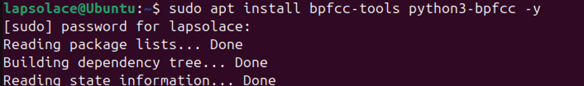
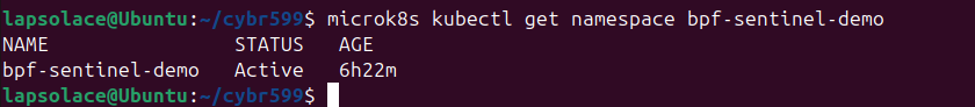
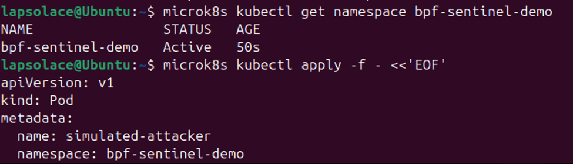
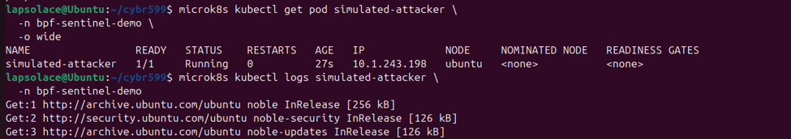
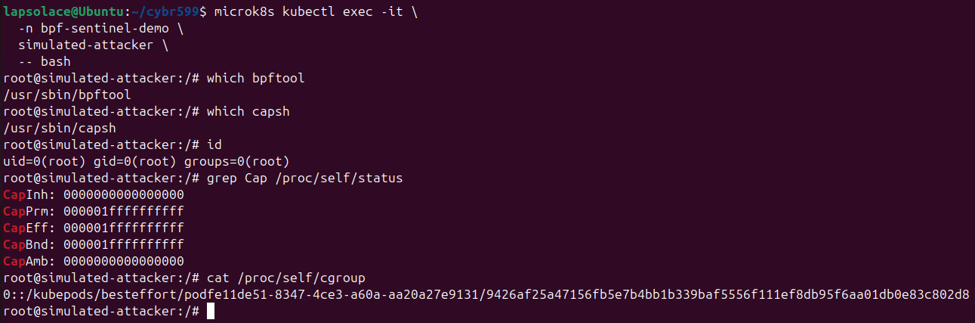
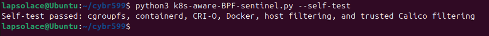
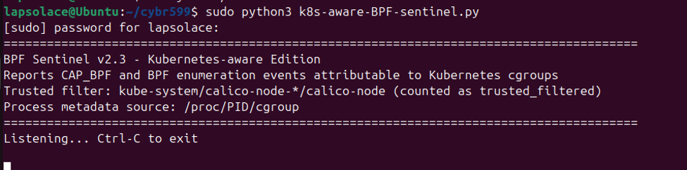
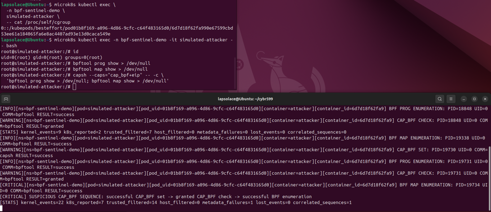
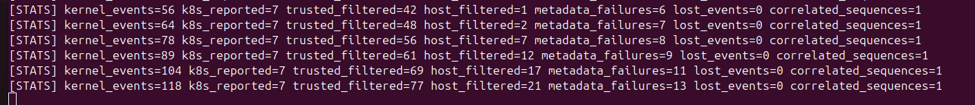

Kubernetes-Aware BPF Sentinel
1.	`sudo apt install bpfcc-tools python3-bpfcc -y` to install the BCC tool. It will provide the BPF compiler collection runtime and python interface that is required for the program.
 

2.	Then I installed microk8s and enable dns to give an environment for the local Kubernetes
```
sudo snap install microk8s --classic
sudo microk8s enable dns
```
3.	I created a demonstration namespace `microk8s kubectl create namespace bpf-sentinel-demo`in other to isolate the test workload. And also confirm its existence with `microk8s kubectl get namespace bpf-sentinel-demo`
 


4.	I created a simulated attacker pod. The pod is privileged specifically so it can exercise BPF operations for the controlled demonstration.
```
microk8s kubectl apply -f - <<'EOF'
apiVersion: v1
kind: Pod
metadata:
  name: simulated-attacker
  namespace: bpf-sentinel-demo
  labels:
    app: bpf-sentinel-test
spec:
  restartPolicy: Never
  serviceAccountName: default
  containers:
    - name: attacker
      image: ubuntu:24.04
      command:
        - /bin/bash
        - -c
        - |
          apt-get update
          DEBIAN_FRONTEND=noninteractive apt-get install -y linux-tools-$(uname -r) libcap2-bin procps
          sleep infinity
      securityContext:
        privileged: true
EOF
```


5.	To confirm the status of the simulated-attacker pod I ran 
```
microk8s kubectl get pod simulated-attacker \
  -n bpf-sentinel-demo \
  -o wide
```


6.	I exec into a shell in the pod to confirm its identity and cgroup
`microk8s kubectl exec -n bpf-sentinel-demo -it simulated-attacker -- bash`
  


7.	On another terminal:
After navigating to the directory where I have the k8s-aware-BPF-sentinel.py program, I performed a self-test of the program with `python3 'k8s-aware-BPF-sentinel.py' --self-test`   to validates cgroup parsing, supported container runtimes, host filtering, and trusted Calico filtering before monitoring begins.
 

8.	Afterward, I started the program with `sudo python3 k8s-aware-BPF-sentinel.py`
 

9.	I noticed the attacker’s pod has changed status to unknown as I logged out of the system, so I had to delete the pod and create it again. 
` microk8s kubectl delete pod simulated-attacker -n bpf-sentinel-demo`

10.	In the attacker’s pod, the following code was executed in a shell to generate the capability and BPF reconnaissance events needed to test Kubernetes attribution and sequence correlation.
```
bpftool prog show > /dev/null
bpftool map show > /dev/null
capsh --caps="cap_bpf+eip" -- -c \
  'bpftool prog show > /dev/null; bpftool map show > /dev/null'
```
 

The output result on the sentinel terminal shows that:
The Sentinel attributed the test activity to the simulated-attacker pod in the bpf-sentinel-demo namespace. It reported successful BPF program and map enumeration, a successful CAP_BPF set operation, and granted CAP_BPF checks before producing a critical correlated-sequence alert.

The final statistics recorded 22 kernel events: seven Kubernetes events were reported, fourteen trusted Calico events were suppressed, and one metadata lookup failed because a short-lived process likely exited before /proc/PID/cgroup could be read. No perf-buffer events were lost, and one complete suspicious sequence was correlated, demonstrating container attribution, noise reduction, and reliable event delivery.

11.	The code below was tested on another terminal to demonstrate the host filtering feature:
```
sudo bpftool prog show > /dev/null
sudo bpftool map show > /dev/null
sudo capsh --caps="cap_bpf+eip" -- -c \
  'bpftool prog show > /dev/null; bpftool map show > /dev/null'
```


The increasing host_filtered counter confirms that the host-generated events were observed but intentionally suppressed. No host alert is printed because the reporting layer is restricted to activity attributable to Kubernetes containers.